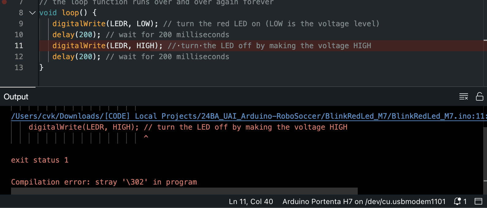

# Portenta-H7_RoboSoccer

Setting up Arduino Portenta H7 with Camera Shield for UAI RoboSoccer '24

## Basic LED Control Example

The Blink.ino sketch demonstrates basic control of the Portenta H7's built-in LED:

```cpp
void setup() {
  pinMode(LED_BUILTIN, OUTPUT);
}

void loop() {
  digitalWrite(LED_BUILTIN, HIGH);  // LED on
  delay(1000);
  digitalWrite(LED_BUILTIN, LOW);   // LED off
  delay(1000);
}
```

**Important Note for Portenta H7**: The built-in RGB LED behavior is inverted compared to other Arduino boards:

- `LOW` turns the LED ON
- `HIGH` turns the LED OFF

### Features

- Basic LED control demonstration
- 1 second blink interval
- Uses built-in LED (no external components needed)

### Hardware Required

- Arduino Portenta H7 board
- USB-C cable for programming

## Dual Core Processing Tutorial Note

While following the [dual-processing tutorial](https://docs.arduino.cc/tutorials/portenta-h7/dual-core-processing/) on Arduino, a bug was encountered. An issue has been raised with Arduino to address this: [Issue #42](https://github.com/arduino-libraries/Arduino_Pro_Tutorials/issues/42). It is hoped that this bug will be resolved for future users.



## License

This project is licensed under the [MIT License](LICENSE).

## Getting Started

1. Install the Arduino IDE
2. Install Portenta H7 board support package
3. Select "Arduino Portenta H7 (M7 core)" as the board
4. Upload the provided sketches to the board

For more detailed instructions, refer to the official Arduino documentation.
