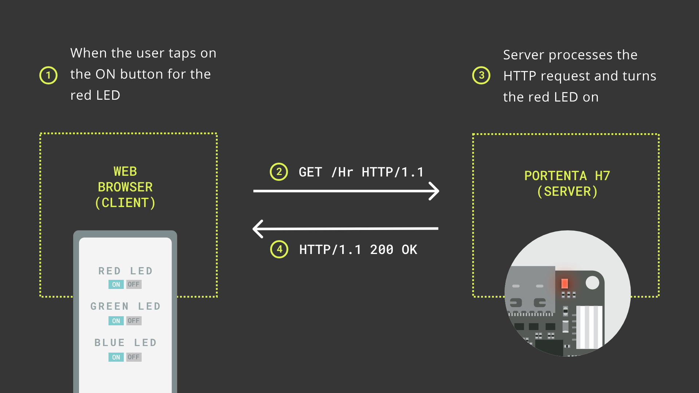

# Phone Controlled LED

In this example, we will create a simple web server that can be controlled by a phone. The server will have three buttons to control the red, green, and blue LEDs on the Portenta H7. The server will be hosted on the Portenta H7 and can be accessed by any device connected to the same network. The server will listen for incoming HTTP GET requests and change the state of the LEDs accordingly.

Whenever a button on the web page is pressed, the client device (in this case your phone) sends a HTTP GET request to a URL denoted by a letter, in this case H or L (H stands for HIGH, L stands for LOW) followed by the LED color that should be turned on or off r, g or b. For example, to turn on the red LED the URL is /Hr . Once the server receives this request, it changes the corresponding LED state, closes the connection and continues to listen to next requests.
